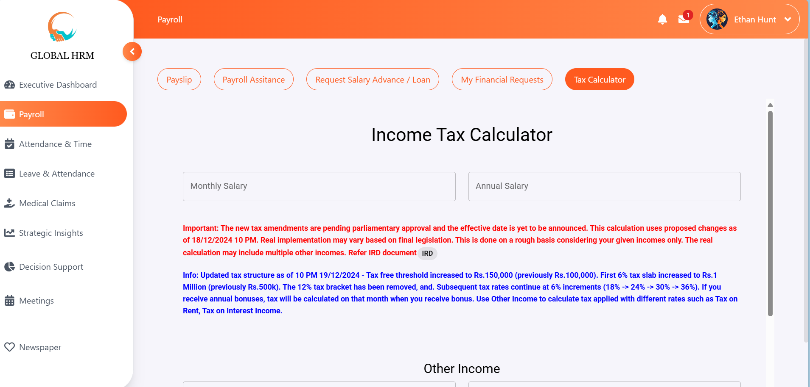
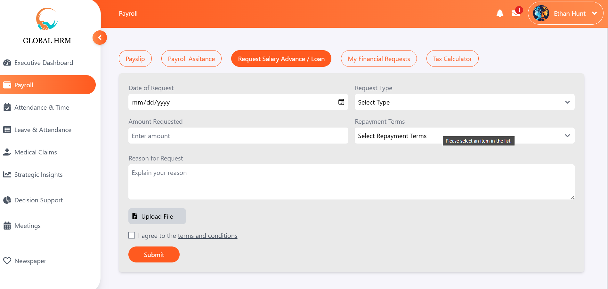
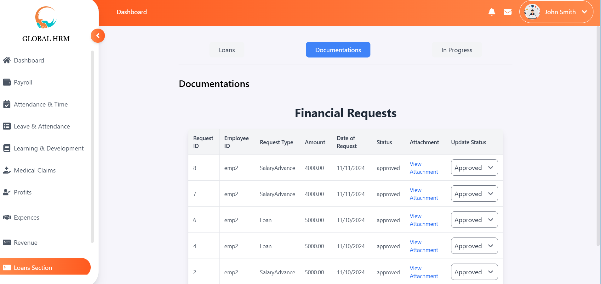

# 🌍 GLOBAL HRM

## Overview
GLOBAL HRM is a powerful and intelligent **Human Resource Management System** designed to help businesses efficiently manage their workforce. It includes advanced features such as employee attendance prediction, payroll automation, performance tracking, and resource planning to optimize HR operations.

---

## 🌟 Features
- **Employee Attendance Prediction**: Utilize AI-driven analytics to predict employee attendance patterns and optimize workforce planning.
- **Payroll Management**: Automate payroll calculations, tax deductions, and salary disbursements.
- **Employee Performance Tracking**: Monitor employee productivity, generate performance reports, and set goals.
- **Recruitment Management**: Streamline the hiring process with application tracking and candidate evaluations.
- **Leave & Attendance Management**: Track leaves, work hours, and absenteeism with real-time monitoring.
- **Training & Development**: Manage employee training programs, certifications, and skill development.
- **HR Analytics & Reports**: Generate detailed reports on HR metrics to support data-driven decision-making.
- **Medical Claims**: Process and manage employee medical claims efficiently.
- **Loan Requests**: Enable employees to request and track loan applications within the system.
- **Strategic Insights**: Gain valuable business insights through HR data analysis and workforce planning.
- **Office Meetups**: Schedule and manage internal office meetups and events.
- **Newspaper**: Share company updates, announcements, and newsletters through an integrated digital newspaper.

---

## 🛠️ Technologies Used
- **Frontend**: React.js
- **Backend**: Node.js, Express.js
- **Database**: MySQL
- **Other Tools**:  Axios, Bootstrap

---

## 🔧 Installation
1. Clone the repository:  
   ```bash
   [git clone https://github.com/yourrepo/GLOBALHRM.git](https://github.com/thisaldil/HRM_Software.git)
   ```
2. Install dependencies for the server:
   ```bash
   cd server && npm install
   ```
3. Install dependencies for the client (web application): 
   ```bash
   cd ../client && npm install
   ```
4. Install dependencies for the mobile application:
   ```bash
   cd ../mobile && npm install
   ```

---

## 🚀 Usage
1. Start the server:  
   ```bash
   cd ../server && npm start
   ```
2. Start the web client:
   ```bash
   cd ../client && npm start
   ```
3. Start the mobile app using Expo:
   ```bash
   cd ../mobile && expo start
   ```
4. Access the application at:
   - Web: http://localhost:3000


---

## 🙌 Contributors

Contributions to this project:

| Name               | GitHub Profile                          | 
|--------------------|-----------------------------------------|
| Thisal | [@thisaldil](https://github.com/thisaldil)     |
| Sandeepa Mallawarachchi | [@sandeepaMallawarachchi](https://github.com/sandeepaMallawarachchi) |


## 📸 Screenshots
<p align="center">
  
  
  
  
  
  
  
  
  
  
  
</p>
